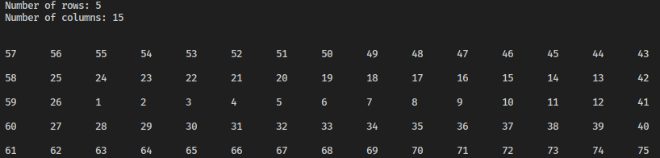
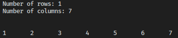
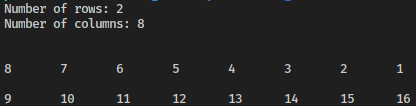
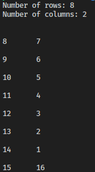
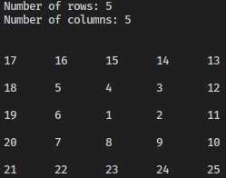
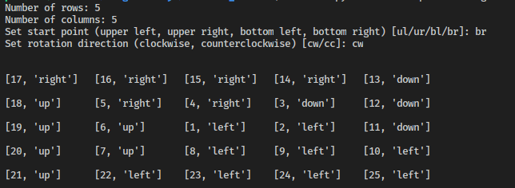
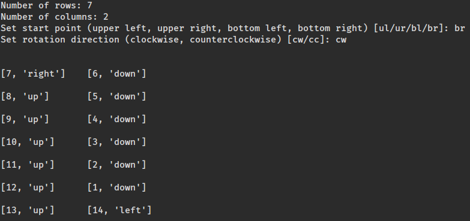
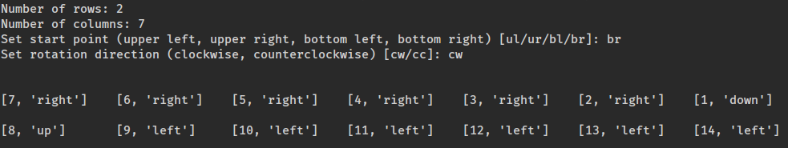
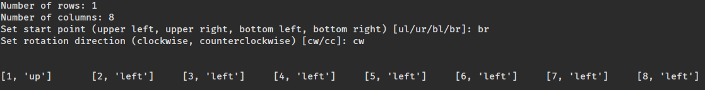
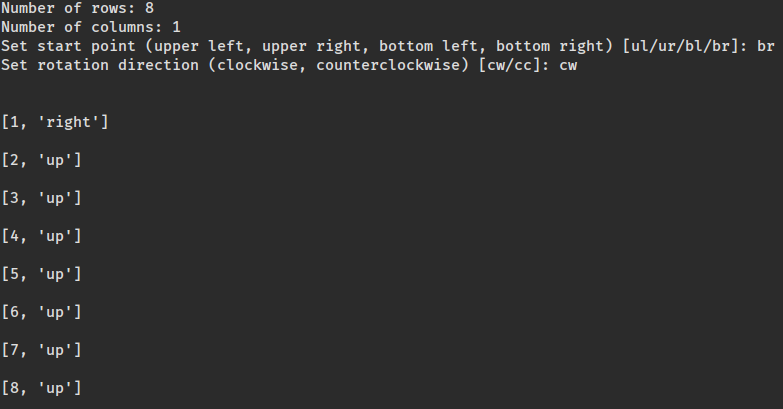

# Ciklična matrica

## PHP

[Poveznica na PHP - Ciklična matrica rješena bez funkcija TRENUTNO NE RADI - POGLEDATI PYTHON RJEŠENJE](https://polaznik41.edunova.hr/matrica/)

[Poveznica na PHP - Ciklična matrica rješena rekurzivnim funkcijama](https://polaznik41.edunova.hr/matrica_func/)

## Python

### Python - rješenje bez funkcija  (circular_flow_matrix_without_functions.py)

**5x15**

**1x7**

**2x8**

**8x2**

**5x5**

### Python - rješenje s rekurzivnim funkcijama (circular_flow_matrix.py)

**5x5**

**7x2**

**2x7**

**1x8**

**8x1**

